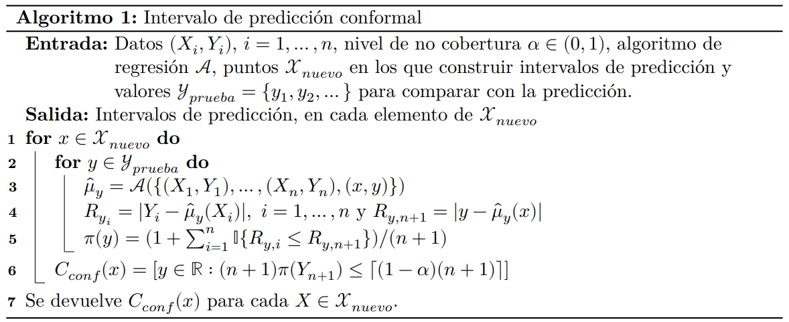
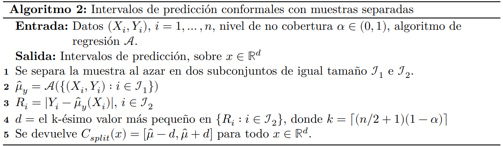
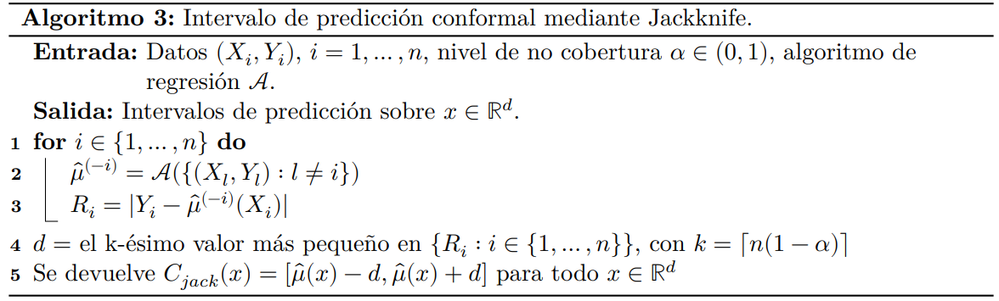

```{r setup, include = F , warning = F }
if(!require(pacman)) {
  install.packages("pacman")
}

library(xaringanthemer)

pacman::p_load(
  RefManageR
)

#Libreria car 
pacman::p_load_gh(
  "gadenbuie/xaringanExtra"
)
# Configuración del tema Xaringan:
style_duo_accent(
  primary_color = "#010788",
  secondary_color = "#01B5FE",
  header_font_google = google_font("Titillium Web", "600"),
   text_font_google   = google_font("Crimson Pro", "300", "300i"),
   code_font_google   = google_font("IBM Plex Mono"),
   base_font_size = "20px",
   text_font_size = "1rem",
   code_font_size = "0.6rem",
   code_inline_font_size = "1.2em",
   footnote_font_size = "0.6em",
   header_h1_font_size = "1.7rem",
   header_h2_font_size = "1.50rem",
   header_h3_font_size = "1.2rem"
)

xaringanExtra::use_xaringan_extra(
  c(
    "tile_view",
    "panelset",
    "progress_bar"
  )
)


xaringanExtra::style_panelset_tabs(
  active_foreground = "#0051BA",
  hover_foreground = "#d22",
  font_family = "Roboto"
)

xaringanExtra::use_banner(
  bottom_left = "bit.ly/my-awesome-talk",
  exclude = "title-slide"
)

xaringanExtra::style_banner(
  text_color = "#1874CD",
  background_color = "#F0F8FF"
)


options(htmltools.dir.version = FALSE)
knitr::opts_chunk$set(
  warning = F, 
  echo = F ,
  out.width = "450px",
  dpi = 200, 
  fig.retina =2
)


if(!require(pacman)) {
  install.packages("pacman")
}


bib <- ReadBib(
  "biblio.bib",
  check = FALSE,
  .Encoding = "UTF-8"
)

BibOptions(
  check.entries = FALSE,
  bib.style = "authortitle",
  cite.style = "alphabetic",
  style = "markdown",
  hyperlink = FALSE,
  max.names = 2,
  dashed = FALSE
)

options(kableExtra.latex.load_packages = FALSE)
```


class: header_background

# Guía

- ### Introducción a la inferencia predictiva

- ### Método Naive para la construcción de intervalos de predicción

- ### Intervalos de predicción conformales

- ### Intervalos de predicción conformales con muestras separadas (simple y múltiple)

---


class: header_background

# Inferencia predictiva

Consideramos el problema $Z_{1},\ldots,Z_{n} \sim F$ $i.i.d$ donde cada $Z_{i} = (X_{i},Y_{i}) \in \mathbb{R}^{d} \times \mathbb{d}$, y queremos predecir $Y_{n+1}$. 

## Algoritmo de regresión

$$
\mu(x) = \mathbb{E}(Y|X=x) ~ x ~ \in \mathbb{R}^{d}
$$


Es de nuestro interes predecir una nueva observación de nuestra variable de respuesta $Y_{n+1}$ a partir de nuestras covariables ${X}_{n+1}$, sin hacer **ningun** supuesto acerca de
$\mu$ ni de $F$. Tomando como referencia un nivel de cobertura $\alpha$ contruiremos un intervalo de predicción conformal para $Y_{n+1}$.

## Intervalo conformal

$$
P\left(Y_{n+1} \in C \left(X\right) \right) \geq 1-\alpha
$$

Asumiendo que la siguiente observación proviene de la misma distribución $F$, con la que fue ajustado el modelo.

---


class: header_background

# Método Naive


.center[

$$\begin{equation}C_{naive}(X_{n+1}) = \left[ \hat{\mu}(X_{n+1}) - \hat{F}^{-1}_n (1-\alpha), \hat{\mu}(X_{n+1}) + \hat{F}^{-1}_n (1-\alpha) \right] \end{equation}$$

**Donde $\hat{F}^{-1}_n$ es la función inversa de la distribución empírica de los residuos del modelo ajustado.**

]

## Cuando funciona bien

- Este método es aproximadamente válido para muestras grandes, bajo la condición que $\hat{\mu}$ sea lo suficientemente preciso.
- Bajo condiciones de regularidad tanto para la distribución $F$ y para la función de regresión $\hat{\mu}$.

## Desventajas

- Estos intervalos pueden presentar una considerable subcobertura, dado que pueen presentar una considerable subcobertura, ya que esta utilizando
los residuos de la muestra.

--

### Solución

**Intervalos de predicción conformales**

---

class: header_background

# Intervalos de predicción conformales

Para cada $y$ se construye un estimador de regresión aumentado $\hat{\mu}_{y}$, el cual se estima en el conjunto de datos aumentado $Z_{1},\dots,Z_{n},(X_{n+1},y)$.

$$\begin{equation} R_{y,i} = |Y_i - \hat{\mu}_y(X_i)|, \,\,\, i = 1,\dots,n \end{equation}$$

--

$$\begin{equation} R_{y,n+1} = |y - \hat{\mu}_y(X_{n+1})| \end{equation}$$

--

Luego, con el residuo $R_{y,n+1}$ se construye su rango entre los demás residuos de la muestra:

$$\begin{equation} \pi(y) = \frac{1}{n+1}\sum_{i=1}^{n+1}\mathbb{I}\{R_{y,i} \le R_{y,n+1}\} = \frac{1}{n+1} + \frac{1}{n+1}\sum_{i=1}^{n}\mathbb{I}\{R_{y,i} \le R_{y,n+1}\} \end{equation}$$

--

Al ser los datos $i.i.d$ se y asumiendo simetría en el estimador de regresión $\hat{\mu}$, se tiene que:

$$\begin{equation}P((n+1)\pi(Y_{n+1})\le \lceil (1-\alpha)(n+1)\rceil) \ge 1-\alpha\end{equation}$$

---

class: header_background

# Intervalos de predicción conformales

Si consideramos la prueba $H_{0}: Y_{n+1} = y$ e invertimos la prueba para obtener la región de acepatación o intervalo de **predicción**

$$\begin{equation}C_{conf}(X_{n+1}) = \left[y \in \mathbb{R}: (n+1)\pi(Y_{n+1})\le \lceil (1-\alpha)(n+1) \rceil \right] \end{equation}$$

Notesé que la prube se aplica para cada valor de la grilla de $y$. Esto implica que para obtener un nuevo intervalo de predicción se tienen que calcular nuevamente:

$$\begin{equation} R_{y,i} = |Y_i - \hat{\mu}_y(X_i)|, \,\,\, i = 1,\dots,n \end{equation}$$

--

$$\begin{equation} R_{y,n+1} = |y - \hat{\mu}_y(X_{n+1})| \end{equation}$$

--

$$\begin{equation} \pi(y) = \frac{1}{n+1}\sum_{i=1}^{n+1}\mathbb{I}\{R_{y,i} \le R_{y,n+1}\} = \frac{1}{n+1} + \frac{1}{n+1}\sum_{i=1}^{n}\mathbb{I}\{R_{y,i} \le R_{y,n+1}\} \end{equation}$$

--

$$\begin{equation}C_{conf}(X_{n+1}) = \left[y \in \mathbb{R}: (n+1)\pi(Y_{n+1})\le \lceil (1-\alpha)(n+1) \rceil \right] \end{equation}$$

---

class: header_background

# En forma de algoritmo

.center[



]

---

class: header_background


# Respaldo teórico

### Inversión de una prueba de hipótesis

Por construcción, el intervalo es construido como la inversión de la prueba de hipótesis mencionada anteriormente a un nivel de significancia $\alpha$, válido para muestras finitas por lo tanto:

$$\begin{equation}P\left(Y_{n+1} \in C_{conf}(X_{n+1}) \right) \geq 1-\alpha \end{equation}$$

### Sobrecobertura

Además, si hacemos el supuesto que los residuos en la muestra tienen una distribución conjunta continua:

$$\begin{equation}P(Y_{n+1}\in C_{conf}(X_{n+1})) \le 1-\alpha + \frac{1}{n+1}\end{equation}$$

--

### Observaciones

- Esta cobertura es **marginal** o promedio, no es lo mismo que $P(Y_{n+1} \in C_{conf}(x)| X_{n+1}=x) \ge 1-\alpha \,\,\, \forall \,\,\, x \in \mathbb{R}^d$

--

- Si mejora el estimador de $\mu$, los intervalos se reducen de forma considerable, ya que se utiliza la distribución de los residuos.

---

class: middle, inverse

# Ejemplo en R

---

class: header_background

# Costo computacional


.center[

### Como se pudo ver en el algoritmo, el costo computacional es alto, ya que se debe calcular el estimador de regresión para cada valor de la grilla de $y$, además, 

### al incluir un nuevo valor de $X$ se debe recalcular el estimador de regresión para cada valor de la grilla de $y$

]


--

### Alternativas

--

- Intervalos de predicción conformales en muestras separadas (**Split conformal Prediction Sets**)

--

- Intervalos de predicción conformales en multiples muestras separadas (**Multiple Split conformal Prediction Sets**)


---

class: header_background

# Intervalos de predicción conformales en muestras separadas

Los autores proponen modificar el algoritmo expuesto anteriormente para reducir el costo computacional, llegando a una versión:

- Depende solo del paso de estimación. De $\mathcal{O}(n^{2})$ pasamos a $\mathcal{O}(n)$.
- Menos requerimientos de memoria, solo hay que almacenar en una partición de la muestra. 

--

.center[



]

---

class: header_background

# Respaldo teórico


## Intervalo de predicción

$$\begin{equation}P(Y_{n+1}\in C_{split}(X_{n+1})) \le 1-\alpha + \frac{2}{n+2}\end{equation}$$

## Cobertura aproximada


$$\begin{equation}P\left(| \frac{2}{n} \sum_{i \in \mathcal{I}_2} \mathbb{I} \{Y_I \in C_{split}(X_i) - (1-\alpha) \ge \epsilon\} | \right) \le 2 \exp{(-cn^2(\epsilon-4/n)^2)} \end{equation}$$


### Inconvenientes

Al considerar diferentes divisiones de la muestra se introduce una fuente adicional de **aleatoriedad** a la estimación.

---
class: middle,center

# Ejemplo en R


---

class: header_background

# Intervalos de predicción conformales en múltiples muestras separadas

Una manera de corregirlo es combinar diferentes inferencias realizadas en $N$ particiones independiente, construtyendo así $C_{split,1}$ y $C_{split,2}$, hasta obtener $C_{split,N}$.

Cada una de estas particiones es construidas a un nivel de significación de $alpha^{*} = 1 - \alpha/N$ y se relacionan de la siguiente manera:

$$\begin{equation}C^{N}_{split}(x) = \cap_{j = 1}^{N} C_{split,j}(x) ~~ x \in R^{d}\end{equation}$$

## Inconvenientes

Si realizamos demasiadas particiones, los intervalos se vuelven cada vez mas anchos, debido a que cada intervalo tiene al menos $1-\alpha$ y con el algortimo 2:

$$\begin{equation} 1 - \frac{\alpha}{N} \leq P(Y_{n+1} \in C_{split}\left(X_{n+1}\right)) \leq 1 - \frac{\alpha}{N} + \frac{2}{n + 2} \leq 1 \end{equation}$$

Si remplazamos nuestro nivel de signifación $\alpha{*} = \alpha/N$

---

class: header_background

# Intervalos mediante Jackknife

Este método emplea los cuantiles de los residuos de validación cruzada, dejando una observación afuera para calcular los intervalos de predicción. Tiene como ventaja
que emplea mas muestra para calcular los resiudos, lo cual se espera que los intervalos tengan una menor amplitud. A consecuencia, no se puede garantizar una cobcertura valida
en muestras finitas e incluso asintóticamente depende fuertemente del estimador.

.center[




]

---

class: header_background

# Conclusiones

- #### Intervalos de predicción, interpretación directa para la toma de decisiones. Mejoras en su construcción son ampliamente valoradas.

--

- #### Dependiendo del método de regresión, para la construcción de intervalos se deben realizar algunos supuestos o utilizar teoría asintótica para su construcción

--

- #### Las conclusiones de los intervalos conformales aceptables son independientes del estimador de regresión que seleccionemos.

--

- #### Estos intervalos son ampliamente utilizados en modelos de machine learning, como pueden ser los métodos de ensamble.

--

- #### Esta metdología se encuentra implementada en el paquete **conformalInference** de R, con algunos modelos 'base' y su extensión puede ser bastante sencilla mediante wrappers de 
#### la función de entrenamiento y predicción.